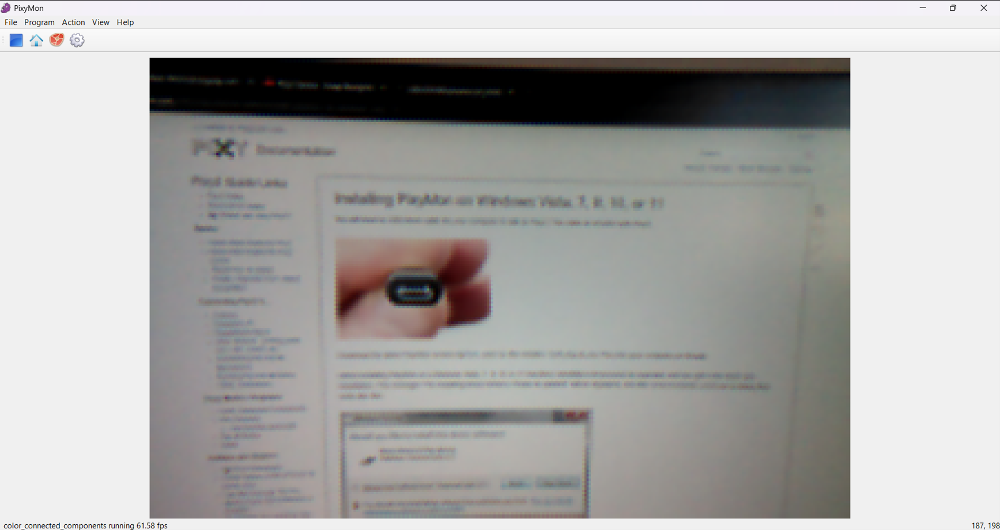

# Getting startet

## Using the Pixy2 on the PC

Dowload the software PixyMon: 	[pixycam.com/downloads-pixy2](https://pixycam.com/downloads-pixy2/)

Then wait a bit, open the software and plug in the camera.
If the software does not find the pixy2, then the driver is not fully isntalled. Wait a few minutes.

After a few minutes, the camera should film the environment: 

Furthere help on:	[docs.pixycam.com/wiki/doku.php?id=wiki:v2:install_pixymon_on_windows_vista_7_8](https://docs.pixycam.com/wiki/doku.php?id=wiki:v2:install_pixymon_on_windows_vista_7_8)

To teach the pixy some objects, see [docs.pixycam.com/wiki/doku.php?id=wiki:v2:teach_pixy_an_object_2](https://docs.pixycam.com/wiki/doku.php?id=wiki:v2:teach_pixy_an_object_2)
